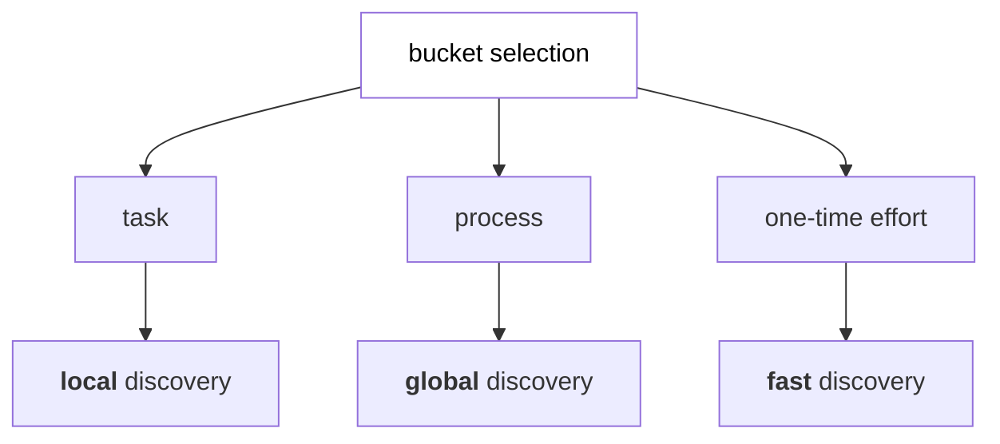



# split workflow

Hopefully you found your project priority based on [priority calculation](/content/posts/automation-requirement-framework-1.md) I covered earlier. You also might already have your own buckets and for sure you have found your type - either **task** or **process**. There is a difference in automating an action that takes 20 minutes of employee's time daily and an complex payroll process that spans across hours or even days. Tasks would usually fall into category of (standard) operating procedures (SOPs) and usually end up as a straightforward translation of person's actions to automation's actions. Processes, on the other hand, are complex, usually cross-team, efforts that include multiple SOPs representing sequence of steps that are interconnected by the final goal. 

Understanding your types is really important at this stage as next steps are taken based on it. Apart from complexity-based split, there's separate flow for **one-time** kind of automation. Those are usually time-bound, scope-limited and require specific type of requirements to begin work on them. One-time are usually migrations, backups or data removal. This type also affects a [priority calculation](/content/posts/automation-requirement-framework-1.md) as deadline is a big factor to take into account.

On each type we do have separate discovery flow - global, local and fast.

## per-type flow

outline:
next steps after task/process split

2. split for process/task (task -> straight to development)
3. process requirements gathering steps
    - must-ask questions (deal breakers)
    - must have (SOPs)
    - good tool for understanding all involved parties - COPIS (or SIPOC)
    - questions for understanding process itself and getting metrics, SLAs, etc.
    - questions for understanding process in company scope
4. process streamline / redefine
    - should there be any additional standardize questions? (technical, organizational, etc.?)